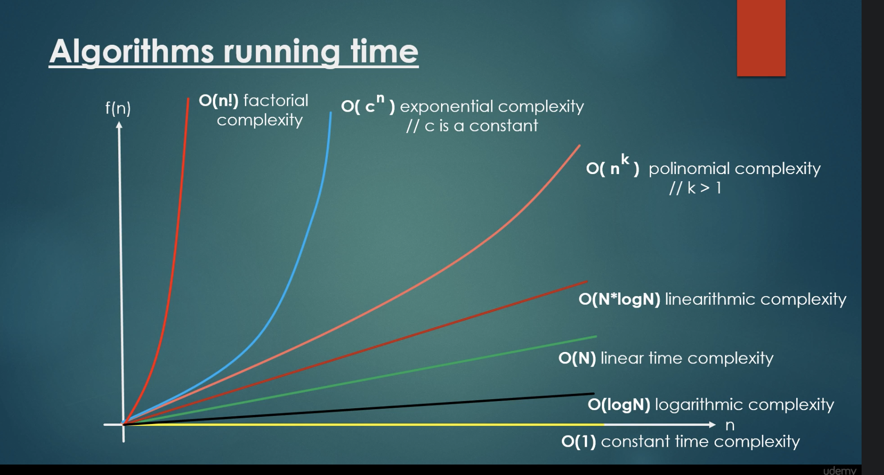

# Data-Structures-Algorithms

## Description 

This is my personal Python reference guide to build up knowledge in complexity theory, data structures and algorithms. I will create notebooks to capture relevant content with examples. As I learn, I aim to create publicly accessible resources for others to learn from in their own coding journey. You may review my Jupyter notebooks for examples of various algorithms as I continue my own journey. I recommend reviewing the resources, which includes courses, articles, videos, etc. for a full explanation of the examples I capture in this repo.

This repo will be updated regularly and is still in its early phases. You can anticipate a mix of references as I make my way in understanding the content myself. All sources are captured in the foot of this README.

# Part 1: Complexity Theory

# Resources
## Complexity Theory
1. [Udemy's Complexity Theory Basics Course](https://www.udemy.com/course/complexity-theory-basics/learn/lecture/5978588#overview) with Holczer Balazs, Software Engineer.
2. [Understanding Time Complexity with Python Examples](https://towardsdatascience.com/understanding-time-complexity-with-python-examples-2bda6e8158a7) by Kelvin Salton do Prado.
